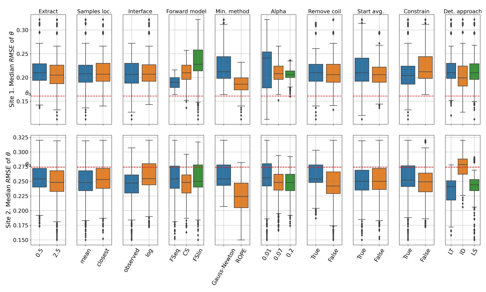

## This is the developed code and data used in the scientific research publication: 
Soil quantitative characterization using frequency domain electromagnetic induction method in heterogeneous fields (https://doi.org/10.5194/egusphere-2024-2693)

### Cite this code using the DOI: 10.5281/zenodo.13385390

